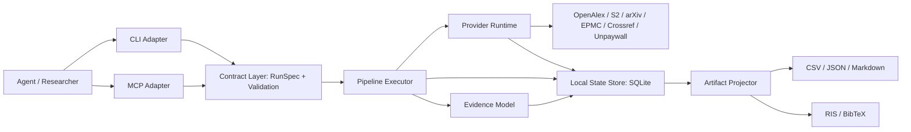

# Litminer 下一代架构设计方案

> 状态：Implemented architecture record
> 基线：`5157395 Improve verification workflow and research iterations`
> 日期：2026-07-15
> 性质：独立设计，不是 `iteration_plan.md` 的续写、补丁或重新排序
> 落地说明：截至 2026-07-20，Milestone A—E 的核心契约、SQLite runtime、
> provider scheduler/ledger、coverage、canonical evidence、RIS/BibTeX、
> 九工具 MCP、恢复/soak/Agent acceptance 均已进入主线。本文现作为设计
> 依据和边界记录；具体发版证据以 `references/release-checklist.md` 为准。

## 1. 核心结论

Litminer 下一阶段不应继续以“给现有流水线增加更多阶段”为主要演进方式，而应正式成为一个：

> **面向 AI Agent、本地运行、可恢复、可审计、对数据源退化保持诚实的科研文献信息运行时。**

它负责可靠地获取、验证、规范化和交付公开书目信息，但不替 Agent 或研究者作科学结论。

新架构围绕三项产品能力重新组织：

1. **确定的 Agent 契约**：CLI、MCP、配置和错误语义来自同一个类型化契约。
2. **可管理的外部不确定性**：限速、TLS、凭证、超时和来源退化成为一等运行状态。
3. **可追溯的证据投影**：原始来源观察与规范化论文记录分离，任何导出都能说明字段从哪里来、为何可信。

这不是推翻当前实现。现有的验证队列、正交状态、增量研究会话、审计报告和缓存机制作为已接受基线保留；新设计解决的是这些能力继续增长后暴露出的契约、状态和编排问题。

---

## 2. 已接受的当前基线

以下能力设计正确，不应回滚或重写其产品语义：

- `dedupe -> pretriage -> verification_queue -> Crossref -> final triage` 两阶段验证顺序。
- `bibliographic_status`、`scientific_review_needed`、`workflow_status` 的正交状态模型。
- Crossref 预算只消耗未解决工作，可信缓存结果可复用。
- 可信书目记录优先进入 publisher evidence queue。
- `--resume` 与 `--merge-into` 分离。
- `research_session_manifest.json` 与 `delta_profile.json` 的跨轮谱系。
- `agent_summary.json`、`result_profile.json`、`search_audit_report.md` 的诚实报告原则。
- 共享 HTTP retry、`Retry-After`、运行内 cooldown、失败缓存和 provider 状态分类。
- CSV/JSON/Markdown 作为人类可检查、Agent 可消费的交付格式。
- core 保持 Python stdlib-only，不引入后台云服务。

新方案只改变这些能力的组织方式和公共契约，不改变已经建立的科学边界。

---

## 3. 当前系统真正需要解决的问题

### 3.1 Agent 接口缺少单一事实来源

当前 CLI 参数、MCP 参数、运行时默认值和文档分别维护。结果是：

- MCP 工具可以出现“声明处没有参数、注册后再复制”的情况。
- `queries`、`query_file`、`input_csv`、`merge_into` 之间的组合约束无法由 schema 表达。
- 工具实际截断 20 条结果，但描述不一定告诉 Agent。
- CLI 与 MCP 可能对同一参数给出不同默认值、枚举或错误文本。
- 新增参数需要同步修改 parser、MCP registry、namespace 转换、文档和测试。

这不是文档问题，而是公共 API 没有统一契约的问题。

### 3.2 Provider 故障仍主要在请求发生后被动处理

当前已有单请求 retry 和单次运行的 circuit breaker，但缺少完整的 provider runtime：

- 没有运行前的凭证、联系邮箱、TLS 和端点能力检查。
- 没有结构化记录每个 provider 实际发出多少请求、重试多少次、等待多久。
- 跨运行失败缓存按具体查询参数命中，不能代表 provider 级健康状态。
- 同一工作区启动第二次运行时，不能可靠继承上一次 429 的 provider-wide `not_before`。
- 并发 worker、查询数量和 provider 限速之间没有统一调度器。
- “某来源返回 0”与“某来源无法使用”仍需下游从 trace 自行推断。

### 3.3 运行状态分散在多个 JSON 文件和进程内对象中

随着 resume、merge、后台 MCP job、失败缓存和跨轮研究会话增加，状态分别存在于：

- `run_manifest.json`
- `research_session_manifest.json`
- provider failure cache JSON
- metadata cache JSON
- MCP 进程内 `JOBS`
- 各阶段 CSV 和报告

这些文件适合交付，不适合继续承担并发更新、事务、跨进程恢复和状态查询职责。

### 3.4 原始来源记录和规范化论文记录仍混在同一行模型中

当前 CSV 行同时承担：

- provider 原始观察
- 去重后的候选
- Crossref 规范化书目
- 语义分流结果
- OA/access 信息
- 工作流状态

这使字段覆盖规则越来越复杂，也让 RIS/BibTeX 导出无法简单回答“作者、标题、年份和期刊究竟应取哪个字段”。

### 3.5 主编排文件已承担过多职责

`run_lit_search.py` 当前同时负责：

- 配置解析与默认值
- 输入模式判断
- resume/merge 语义
- stage 编排
- 时间预算与取消
- manifest 更新
- 报告刷新
- CLI parser

继续向其中增加 provider 健康、导出、MCP 契约或更多阶段，会增加修改耦合和回归风险。

### 3.6 测试覆盖了功能，但尚未形成外部服务接受标准

现有单元测试和 Agent 场景测试已经很好地覆盖本地确定性行为。仍缺少正式的 live acceptance matrix，用来回答：

- 无 API key 时哪些来源应正常、哪些应降级。
- 有 key 但 key 无效时错误如何分类。
- 429、401/403、TLS EOF、超时和无效 JSON 是否生成统一结果。
- 多来源部分失败时，整次运行应是 `completed`、`degraded` 还是 `failed`。
- provider 协议发生字段变化时，适配器能否及时暴露 contract drift。

---

## 4. 不可破坏的设计原则

### P1. Provider 不可用不等于文献不存在

任何 0 结果都必须带来源健康上下文。只有已成功执行的查询可以贡献“本次检索未返回候选”这一机械事实。

### P2. 原始观察不可被规范化结果覆盖

来源返回的原始书目信息应作为 observation 保留；Crossref 或其他可信源生成新的 canonical projection，而不是静默改写来源证据。

### P3. 科学判断不进入 core

Litminer 可以排序、标记、统计和暴露证据，但不自动决定研究问题、纳排标准、科学重要性或领域结论。

### P4. 错误必须是数据

Agent 不应通过解析 traceback 或自然语言字符串判断下一步。错误分类、HTTP 状态、瞬态属性、重试建议和请求计数必须结构化。

### P5. 公共契约只能有一个定义源

CLI、MCP、配置验证、文档表格和测试 schema 必须从同一个 `RunSpec`/tool contract 生成或校验。

### P6. 内部状态和交付物分离

内部状态存储负责事务、恢复和查询；CSV/JSON/Markdown/RIS/BibTeX 是可重建的交付快照。

### P7. 不规避公共基础设施限制

不做 IP 轮换、多邮箱、代理池或并发绕限速。调度器只负责降低压力、遵守 `Retry-After` 和诚实降级。

### P8. 迁移必须增量完成

不得以一次性重写替换当前可工作的流水线。每个里程碑都必须保持现有 CLI、主要 artifacts 和离线测试可用。

---

## 5. 目标架构



目标不是引入服务端系统，而是在本地建立清晰的六层边界：

1. Contract Layer
2. Interface Adapters
3. Pipeline Executor
4. Provider Runtime
5. Evidence Model + State Store
6. Artifact Projector

---

## 6. Contract Layer：统一运行契约

### 6.1 `RunSpec`

新增不可变、可序列化的运行定义，替代到处传递的宽松 `argparse.Namespace`。

建议的输入模式：

| 模式 | 必需输入 | 语义 |
|------|----------|------|
| `discover` | `queries` 或 `query_file` | 从公开来源发现新候选 |
| `import` | `input_csv` | 对已有候选运行验证、triage 和报告 |
| `iterate` | `merge_into`，以及新 `queries`/`query_file`/`input_csv` 之一 | 创建新的研究迭代并重算候选池 |

示例：

```json
{
  "schema_version": 1,
  "input": {
    "mode": "discover",
    "queries": ["clinical LLM external validation"],
    "year_from": 2024,
    "year_to": 2026
  },
  "retrieval": {
    "sources": ["openalex", "europe_pmc"],
    "mode": "balanced",
    "strict_discovery": false
  },
  "verification": {
    "crossref_row_budget": 100,
    "unpaywall_row_budget": 100
  },
  "concepts": {
    "required": ["validation=external validation|independent cohort"],
    "optional": [],
    "negative": ["review=systematic review|scoping review"]
  },
  "output": {
    "directory": ".litminer/runs/clinical_validation"
  }
}
```

### 6.2 单一 schema 来源

`RunSpec` 字段定义应同时驱动：

- Python validation
- CLI 参数映射
- MCP `inputSchema`
- runtime config validation
- 文档中的参数表
- schema contract tests

CLI 旧参数继续保留，由 adapter 转换成 `RunSpec`。MCP 不再复制一套手写参数字典。

### 6.3 统一运行结果

所有同步、异步、CLI 和 MCP 调用最终返回同一种 `RunOutcome`：

```json
{
  "ok": true,
  "run_id": "run_...",
  "status": "completed",
  "quality": "degraded",
  "artifacts": {},
  "coverage": {},
  "warnings": [],
  "next_actions": []
}
```

`status` 描述执行状态：

- `queued`
- `running`
- `partial`
- `completed`
- `cancelled`
- `failed`

`quality` 独立描述证据获取质量：

- `healthy`
- `degraded`
- `inconclusive`

这样一次执行可以是 `status=completed`、`quality=degraded`，不会再把“程序跑完了”和“来源覆盖正常”混为一谈。

### 6.4 统一错误封装

```json
{
  "ok": false,
  "error": {
    "class": "rate_limited",
    "code": "provider_rate_limited",
    "message": "Semantic Scholar rate limit persisted",
    "provider": "semantic_scholar",
    "http_status": 429,
    "transient": true,
    "retry_after_seconds": 120,
    "attempts": 4,
    "request_count": 4,
    "stage": "discovery",
    "next_actions": [
      "resume_after_retry_after",
      "continue_with_healthy_sources"
    ]
  }
}
```

建议固定错误 class：

- `validation`
- `workspace`
- `auth`
- `rate_limited`
- `network`
- `tls`
- `timeout`
- `provider_response`
- `budget_limited`
- `cancelled`
- `internal`

Provider 级失败使用 tool result 中的结构化错误；JSON-RPC protocol error 只处理未知 method、无效 JSON-RPC 和服务器协议错误。

---

## 7. Provider Runtime：把外部不确定性变成受控状态

### 7.1 静态能力与动态健康分离

现有 `ProviderSpec` 保留，但拆成两类数据：

**静态能力：**

- 是否支持发现、DOI lookup、年份过滤、摘要。
- 是否需要 key/contact email。
- 推荐请求间隔、最大并发和默认超时。
- 支持哪些查询语法。

**动态健康：**

- `last_success_at`
- `last_failure_at`
- `last_status_class`
- `failure_streak`
- `not_before`
- `last_retry_after_seconds`
- `credential_state`
- `tls_state`
- `recent_latency_ms`

### 7.2 两级 preflight

#### 静态 preflight

不发网络请求，检查：

- 必需环境变量是否存在。
- contact email 格式是否合理。
- 配置的 source 与运行模式是否冲突。
- query 数量、行预算和并发是否可能造成高风险调用。
- provider 是否适合当前领域。

#### Live preflight

默认只在显式请求或 acceptance profile 中执行，用一个低成本请求检查：

- DNS/TLS/endpoint 可达性。
- key 是否被接受。
- provider 是否已经限速。
- 响应结构是否符合适配器预期。

Live preflight 本身也必须计入 request ledger，不能成为隐藏调用。

### 7.3 Provider scheduler

每个 provider 有独立调度 lane：

- 默认并发为 1，只有 provider 明确允许时才提高。
- 使用最小请求间隔，而不是 worker 尽快发完。
- 429 后持久化 provider-wide `not_before`。
- 遵守 `Retry-After`；没有 header 时使用指数退避和 jitter。
- 401/403 立即停止该 provider，不进行无意义重试。
- TLS/网络错误按有限次数重试，之后进入短 cooldown。
- 同一运行的查询预算、请求预算和重试预算分别统计。

禁止自动切换 IP、邮箱或凭证规避限制。

### 7.4 Request ledger

每次外部请求记录：

- `request_id`
- `run_id` / `iteration_id`
- `provider`
- `operation`
- 查询指纹，不默认保存敏感完整 URL
- `attempt`
- `started_at` / `ended_at`
- `http_status`
- `status_class`
- `retry_after_seconds`
- `response_bytes`
- `cache_status`
- `error_code`

运行报告由 ledger 聚合出：

- 每个 provider 的真实请求数和重试数。
- 因 cooldown 被抑制的请求数。
- API 时间占比。
- 预算消耗和剩余量。
- 失败是否影响检索广度或验证覆盖。

---

## 8. Local State Store：内部状态使用 SQLite

### 8.1 为什么使用 SQLite

SQLite 属于 Python stdlib，仍满足零强制依赖和本地运行边界，同时提供：

- 原子事务。
- 跨进程安全更新。
- 后台 MCP job 重启后的状态恢复。
- provider-wide cooldown 的跨运行共享。
- 可查询的研究会话和阶段历史。
- schema migration，而不是多个 JSON 文件各自演进。

建议位置：

```text
.litminer/state/litminer.sqlite3
```

数据库只承担内部运行状态和证据账本。用户交付仍是普通文件。

### 8.2 最小数据表

| 表 | 作用 |
|----|------|
| `schema_migrations` | 状态库版本和迁移记录 |
| `research_sessions` | 研究会话 |
| `iterations` | 每次 discover/import/iterate 运行 |
| `stage_runs` | 阶段状态、输入输出指纹、耗时和错误 |
| `provider_health` | provider-wide 动态健康和 `not_before` |
| `provider_requests` | 请求 ledger |
| `source_observations` | provider 原始论文观察 |
| `paper_records` | 去重后的论文实体 |
| `paper_identifiers` | DOI、PMID、PMCID、arXiv ID 等 |
| `field_values` | 候选字段值、来源和信任级别 |
| `artifact_snapshots` | 已生成 artifact 的 hash、schema 和路径 |

### 8.3 状态库不是新的用户锁定

必须满足：

- `litminer export-state` 可导出运行状态 JSON。
- 主要 CSV/JSON/Markdown artifacts 不依赖数据库才能阅读。
- 删除数据库不会破坏已经交付的研究结果文件。
- artifact projector 可以从状态库重建当前 artifacts。
- 路径尽量使用 workspace-relative 表达，保证目录可移动。

---

## 9. Evidence Model：Observation 与 Canonical Paper 分离

### 9.1 Source Observation

每个 provider 返回一次论文记录，就生成一个不可变 observation：

```text
observation_id
provider
operation
query_id
retrieved_at
raw_identifier
raw_title
raw_authors
raw_year
raw_container
raw_abstract
raw_urls
raw_payload_hash
```

同一篇论文可以有多个 observation，不互相覆盖。

### 9.2 Paper Record

去重层把 observation 关联到一个 `paper_id`。`paper_id` 不直接等于 DOI，因为候选可能暂时没有 DOI。

标识优先级：

1. 规范化 DOI
2. PMID/PMCID/arXiv ID 等稳定标识
3. 规范化标题 + 年份 + 第一作者指纹
4. 临时候选 ID

标识恢复后合并实体，但保留原始 observation 和合并审计记录。

### 9.3 Canonical Projection

用户看到的 `canonical_papers.csv` 是从字段候选中投影出的结果：

| 字段 | 默认优先级 |
|------|------------|
| DOI | Crossref verified > provider normalized DOI > recovered DOI |
| 标题 | Crossref trusted title > publisher meta > discovery title |
| 作者 | Crossref structured authors > publisher meta > provider authors |
| 年份 | Crossref published/online date > publisher online date > discovery year |
| 期刊 | Crossref container > publisher meta > discovery journal |
| URL | DOI resolver > publisher URL > OA landing > aggregator provenance URL |

每个 canonical 字段必须能返回：

- 选中的值。
- 来源 observation/verification。
- 信任类别。
- 选择原因。

`field_provenance.json` 不再通过事后猜测生成，而是 canonical projection 的直接输出。

### 9.4 科学状态仍是独立投影

语义概念匹配、优先级和科学审查状态不进入 bibliographic canonicalization。它们作为同一 `paper_id` 上的当前 iteration annotation 保存。

---

## 10. Pipeline Executor：显式阶段状态机

### 10.1 标准阶段

```text
plan
  -> preflight
  -> discover/import
  -> normalize
  -> dedupe
  -> pretriage
  -> build_verification_queue
  -> verify_bibliography
  -> final_triage
  -> enrich_access
  -> build_publisher_queue
  -> finalize
  -> export (optional)
```

引用扩展不是旁路。它产生新的 source observations，然后回到 `normalize -> dedupe -> pretriage`。

### 10.2 Stage contract

每个阶段实现同一接口：

```python
class Stage(Protocol):
    name: str

    def fingerprint(self, context: RunContext) -> str: ...
    def preconditions(self, context: RunContext) -> list[Issue]: ...
    def execute(self, context: RunContext) -> StageResult: ...
```

`StageResult` 至少包含：

- `status`
- `status_class`
- `input_count`
- `output_count`
- `artifact_ids`
- `warnings`
- `errors`
- `coverage_impact`
- `started_at` / `completed_at`

executor 统一处理：

- manifest/state store 更新。
- atomic output。
- resume fingerprint。
- 时间预算。
- cooperative cancellation。
- partial/degraded/failed 聚合。
- processing report 刷新。

### 10.3 `run_lit_search.py` 的目标职责

最终只保留：

- CLI adapter。
- `RunSpec` 构建。
- executor 调用。
- 人类可读 stdout 摘要。

阶段实现和状态更新不再继续进入该文件。

---

## 11. Coverage Model：把来源退化变成正式结果

新增稳定 artifact：`coverage_report.json`。

### 11.1 每个来源的覆盖状态

```json
{
  "provider": "openalex",
  "configured": true,
  "preflight": "warning",
  "attempted_queries": 8,
  "successful_queries": 0,
  "failed_queries": 1,
  "suppressed_queries": 7,
  "status_class": "rate_limited",
  "candidate_count": 0,
  "coverage_contribution": "unavailable",
  "next_actions": []
}
```

### 11.2 整次运行的质量状态

| 条件 | `quality` |
|------|-----------|
| 计划中的核心来源均健康执行 | `healthy` |
| 至少一个来源成功，但重要来源失败或大量查询被抑制 | `degraded` |
| 所有发现来源不可用，或结果无法支持任何检索判断 | `inconclusive` |

`candidate_count=0` 时：

- `quality=healthy`：可以说“这些已执行查询本次未返回候选”。
- `quality=degraded`：只能说“可用来源未返回候选，其他来源失败”。
- `quality=inconclusive`：不能对文献是否存在作任何判断。

### 11.3 验证覆盖单独报告

发现覆盖和书目验证覆盖不能混为一个 completeness 数字。至少分别提供：

- discovery source health
- query execution coverage
- DOI availability
- Crossref verification coverage
- OA annotation coverage
- publisher inspection coverage

Litminer 不输出“研究领域召回率”。

---

## 12. MCP 重新设计

### 12.1 默认工具面收敛

建议默认只公开以下高层工具：

| 工具 | 作用 |
|------|------|
| `litminer_workspace_doctor` | 检查本地环境和 workspace |
| `litminer_capabilities` | 返回 provider 能力、凭证状态和可选 live preflight |
| `litminer_plan_run` | 校验 `RunSpec`，返回预计阶段、来源和风险，不执行 |
| `litminer_start_run` | 异步启动一次运行 |
| `litminer_get_run` | 查询状态、quality、coverage、artifacts 和 next actions |
| `litminer_resume_run` | 恢复相同签名的中断运行 |
| `litminer_cancel_run` | 请求阶段边界取消 |
| `litminer_read_results` | 分页读取 canonical/triage/coverage 结果 |
| `litminer_export` | 基于 canonical records 导出 RIS/BibTeX |

同步 full-run 工具可以保留在 advanced profile，避免普通 Agent 因长时间调用超时。

低层 provider wrapper、单阶段工具和调试工具继续留在 `advanced` profile。

### 12.2 MCP schema 必须表达真实约束

- 使用 `oneOf`/`anyOf` 表达输入模式。
- 所有 enum、默认值、范围和截断行为显式公开。
- 搜索结果统一分页，不再隐藏地只返回前 20 条。
- `read_results` 返回 `page`、`page_size`、`total_rows`、`has_more`。
- 不允许注册完成后再 mutation 参数 schema。
- `start_run` 与 CLI 使用同一个 `RunSpec` schema。

### 12.3 MCP 错误语义

- 参数验证错误：`isError=true`，`error.class=validation`。
- workspace 越界：`error.class=workspace`。
- provider 失败：工具调用本身可以成功返回 degraded outcome，不必全部升级为 JSON-RPC error。
- 未捕获内部异常才使用 `error.class=internal`，traceback 仅在 debug 模式下提供。

---

## 13. RIS/BibTeX：建立在 Canonical Export Contract 上

### 13.1 默认导出资格

默认只导出：

- `bibliographic_status in {verified, title_recovered}`
- 有标题
- 未被明确标记为 retracted

未验证记录只能通过显式 `--include-unverified` 导出，并在 `export_manifest.json` 中记录数量和风险。

### 13.2 统一导出输入

所有格式只能消费 `CanonicalPaper`，不能直接从任意阶段 CSV 猜测字段。

```python
@dataclass(frozen=True)
class CanonicalPaper:
    paper_id: str
    entry_type: str
    title: str
    authors: tuple[Author, ...]
    year: int | None
    journal: str
    doi: str
    url: str
    volume: str
    issue: str
    pages: str
    publisher: str
    abstract: str
    bibliographic_status: str
    provenance: dict[str, str]
```

### 13.3 RIS 规则

- 按 article/preprint/conference 等映射 `TY`。
- 每位作者一个 `AU`。
- DOI 写 `DO`，规范 URL 写 `UR`。
- 期刊、卷期页、年份使用 canonical fields。
- 换行、空字段和 Unicode 有固定测试。
- 每条记录以 `ER  -` 结束。

### 13.4 BibTeX 规则

- 通过 article/inproceedings/misc 等选择 entry type。
- cite key 默认：`FirstAuthorYearTitleToken`。
- 冲突时按稳定 `a/b/c` 后缀解决，不能依赖输入顺序随机变化。
- 明确定义 `{}`、反斜杠、百分号、与号、下划线等转义策略。
- 默认保留 Unicode；可选 `--ascii-latex` 才做 LaTeX 转写。
- DOI 使用裸 DOI，URL 使用规范 resolver/publisher URL。

### 13.5 导出审计

每次导出生成 `export_manifest.json`：

- 输入 canonical snapshot hash。
- 格式和 exporter schema version。
- 导出数量。
- 排除数量及原因。
- 未验证记录数量。
- cite key 冲突数量。
- 输出文件 hash。

---

## 14. 建议包结构

```text
litminer/
  contracts/
    run_spec.py
    outcomes.py
    errors.py
    tool_contracts.py
  interfaces/
    cli.py
    mcp.py
  runtime/
    state_store.py
    migrations.py
    provider_runtime.py
    provider_scheduler.py
    stage_executor.py
  pipeline/
    plan.py
    discovery.py
    normalize.py
    dedupe.py
    pretriage.py
    verification.py
    final_triage.py
    access.py
    publisher_queue.py
    finalize.py
  evidence/
    observations.py
    identifiers.py
    canonicalize.py
    provenance.py
    coverage.py
  exporters/
    common.py
    ris.py
    bibtex.py
  sources/
    api/
    adapters/
  reports/
    agent_summary.py
    processing_report.py
    audit_report.py
```

这是一项目标结构，不要求一次移动所有现有文件。旧模块可先作为 adapter 被新 executor 调用，随后逐步迁移。

---

## 15. 实施路线

### Milestone A：公共契约稳定化

**目标：** 不改变检索算法，先让 CLI/MCP/错误语义一致。

工作项：

- 引入 `RunSpec`、`RunOutcome`、`ErrorEnvelope`。
- 将现有 CLI 参数转换成 `RunSpec`。
- MCP schema 从 contract 生成。
- 完成所有工具 description、组合约束、分页和截断语义。
- 工具错误使用结构化 `isError` 结果。
- 增加 CLI/MCP parity tests。

退出标准：

- 同一个输入在 CLI 与 MCP 产生等价 `RunSpec`。
- `tools/list` 不再依赖注册后的参数 mutation。
- 每个公共错误都有稳定 `class` 和 `code`。
- 现有 116 个单元测试与 Agent 场景全部继续通过。

### Milestone B：状态库与 Provider Runtime

**目标：** 让 provider 健康、请求预算和后台运行可跨进程恢复。

工作项：

- 建立 SQLite state store 和 migration runner。
- 将 provider health、request ledger 和 MCP job 状态写入状态库。
- 引入 provider scheduler。
- 增加 static/live preflight。
- 429 的 `not_before` 按 provider 跨运行持久化。
- 生成 `coverage_report.json`。

退出标准：

- 第一次运行收到 429 后，第二次运行不会在 `not_before` 前再次调用同一 provider。
- MCP server 重启后仍能读取已启动 job 的最终/中断状态。
- 每个 provider 的请求数、重试数和等待时间可从 ledger 重建。
- 所有来源失败时运行结果为 `quality=inconclusive`。

### Milestone C：Pipeline Executor

**目标：** 从巨型编排函数迁移到显式阶段状态机。

工作项：

- 建立 `Stage`/`StageResult`/`RunContext`。
- executor 统一处理 resume、cancel、time budget 和 stage artifact。
- 逐步迁移 discovery、pretriage、verification、finalize。
- `run_lit_search.py` 退化为兼容 CLI adapter。
- 现有 JSON artifacts 由 projector 生成并保持兼容。

退出标准：

- 每个阶段可独立测试，无需构造完整 `argparse.Namespace`。
- 任何阶段中断后都可从前一完成边界恢复。
- manifest、state store 和实际 artifact 不出现状态漂移。

### Milestone D：Evidence Model 与可信导出

**目标：** 分离 source observation 和 canonical paper，交付可靠 RIS/BibTeX。

工作项：

- 建立 observation、paper identity、field candidate 和 canonicalization。
- 生成 `canonical_papers.csv` 与直接 provenance。
- 先实现 RIS，再实现 BibTeX。
- 增加 `litminer_export` CLI/MCP 工具。
- 提供 `export_manifest.json`。

退出标准：

- 相同 canonical snapshot 多次导出字节稳定。
- 未验证记录默认不进入导出。
- BibTeX key 冲突结果稳定。
- RIS/BibTeX fixture 可被至少一种主流文献管理器正确导入。

### Milestone E：接受测试与兼容清理

**目标：** 用真实 provider 行为验证产品，而不仅是验证函数。

工作项：

- 建立安全 live acceptance profiles。
- 覆盖 key/no-key、429、401/403、TLS、timeout、invalid response。
- 保存经过脱敏的 provider contract fixtures。
- 为旧运行目录提供只读兼容加载。
- 更新 README、SKILL 和 artifact contracts。
- 在兼容期后删除重复 schema 和旧内部状态路径。

退出标准：

- offline、failure-injection、MCP、resume、live-provider 五类验证均有稳定入口。
- Provider 协议漂移会产生明确 contract failure，而不是静默空结果。
- 旧 artifacts 仍可由 Agent 读取，新 artifacts 有 schema migration 说明。

---

## 16. 测试战略

### 16.1 单元测试

- `RunSpec` 组合约束。
- error classification。
- scheduler backoff、jitter 和 `Retry-After`。
- provider health 状态转换。
- canonical field selection。
- RIS/BibTeX escaping 和 key collision。

### 16.2 状态机测试

- 每个 stage 的 completed/partial/failed/cancelled。
- resume fingerprint 匹配和不匹配。
- merge iteration 与 resume 不混淆。
- SQLite transaction rollback 后 artifacts 不假完成。

### 16.3 Failure injection

所有 provider 必须共享以下故障用例：

- 429 with/without `Retry-After`
- 401/403
- 500/502/503
- DNS/timeout
- TLS handshake/EOF
- invalid JSON/XML
- partial pagination response

### 16.4 Agent 场景测试

新增场景：

- 两个来源成功、两个来源失败，Agent 必须报告 degraded coverage。
- 所有来源失败，Agent 不得声称没有文献。
- 429 后立即重新运行，必须读取 provider-wide cooldown。
- MCP schema 缺少必需输入时，在执行前返回 validation error。
- 默认导出排除未验证行，并报告排除原因。

### 16.5 Live acceptance

Live 测试必须：

- 使用极低请求量。
- 不作为普通单元测试默认执行。
- 明确区分“provider 当前不可用”和“代码回归”。
- 输出脱敏报告，不保存 API key 或完整敏感 URL。
- 不通过提高并发或轮换身份追求通过率。

---

## 17. 兼容和迁移策略

### 17.1 双写期

引入 state store 后，先同时写：

- SQLite 内部状态。
- 现有 `run_manifest.json`、`research_session_manifest.json` 和主要 artifacts。

读取优先级：新运行读 SQLite；旧运行仍从文件恢复。

### 17.2 CLI 兼容

现有参数在至少一个兼容周期内继续工作。adapter 将其映射为新 `RunSpec`，并对含混组合给出明确 warning/error。

### 17.3 Artifact 兼容

- 不删除当前稳定字段。
- 新字段只追加。
- 新增 `schema_version` migration note。
- `canonical_papers.csv` 是新增主投影，不立即替代 `triaged_candidates.csv`。

### 17.4 MCP 兼容

高层新工具进入默认 profile；旧低层工具移动到 advanced profile，不立即删除。旧工具返回 deprecation note 和对应新工具。

---

## 18. 明确不做

- 不做 API 限速规避、代理池、多身份轮换。
- 不在 core 持有 institutional credentials。
- 不执行 JavaScript 或突破 paywall。
- 不解析 PDF、表格或 supplementary information。
- 不让 LLM 自动修改科学纳排标准。
- 不自动生成并执行无限扩展查询。
- 不做 Web UI、多用户权限或云端协作平台。
- 不把 SQLite 变成远程服务或强制数据库部署。
- 不以 RIS/BibTeX 为由扩张成通用论文管理器。

---

## 19. 优先级决策

| 优先级 | 工作 | 原因 |
|--------|------|------|
| P0 | Contract Layer、完整 MCP schema、统一错误封装 | Agent 当前无法稳定理解和恢复所有调用 |
| P0 | Provider health、request ledger、coverage quality | API 故障已经实际改变检索来源构成 |
| P1 | SQLite state store 与 provider-wide cooldown | 现有跨运行状态已经超过简单 JSON cache 的职责 |
| P1 | Pipeline Executor | 防止主编排文件继续膨胀并降低后续改动风险 |
| P1 | Canonical Evidence Model | 导出、provenance 和字段可信度的共同前置条件 |
| P2 | RIS/BibTeX | 高用户价值，但必须建立在 canonical contract 上 |
| P2 | 完整 live acceptance matrix | 发布可信度和 provider drift 监测 |
| 不做 | 限速规避、PDF/SI、科学自动决策、Web UI | 超出产品边界或破坏诚实原则 |

---

## 20. 全部完成的定义

只有同时满足以下条件，才能认为下一代架构完成：

1. CLI 和 MCP 从同一 `RunSpec` schema 工作。
2. 每个错误都能被 Agent 通过结构化字段分类并选择下一步。
3. 429、TLS、auth 和 timeout 不再依赖自然语言日志解释。
4. Provider cooldown 和 request ledger 可以跨运行、跨 MCP 进程恢复。
5. 运行完成状态与检索质量状态彼此独立。
6. 0 结果永远带健康来源上下文。
7. 原始 observation、canonical paper 和 scientific annotation 清晰分层。
8. 每个 canonical 字段都能解释来源和选择理由。
9. RIS/BibTeX 默认只交付可信书目，并有独立导出审计。
10. 当前稳定 artifacts 和既有运行目录仍可读取。
11. 单元、Agent 场景、MCP、恢复、安全和低频 live-provider 验证全部有绿色证据。
12. `run_lit_search.py` 不再是新增运行能力的默认落点。

---

## 21. 与旧计划的关系

本方案不继承旧计划的“第几轮”结构，也不以 4.1、4.4 为起点。

旧 `iteration_plan.md` 保留为历史决策和已完成工作记录。本方案已从候选
路线图转为当前架构记录；后续演进不得回退已经落地的共享契约、状态、
证据和恢复语义。

旧计划中的两个关键事项已经按本方案重新定义并完成：

- MCP 描述补全成为 Contract Layer、客户端兼容 Schema 和真实 Agent
  acceptance 的组合，而不是文档润色。
- RIS/BibTeX 成为 Canonical Evidence Model 的下游 exporter，并带独立
  `export_manifest.json`，而不是任意 CSV 文本模板。

当前剩余工作属于持续发布工程：保持 Codex/Claude、provider、Windows 和
macOS 原生证据绿色，并按现有模块边界继续降低兼容 runner/MCP 入口的
集中度；它们不是重新开启一次架构重写。
